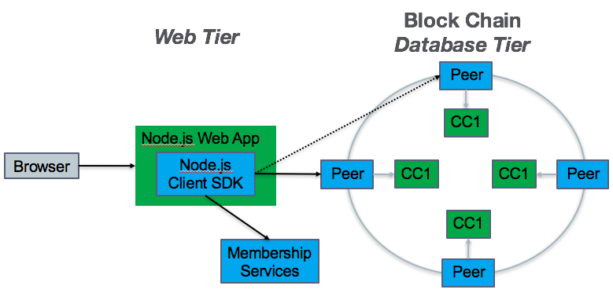

# Application Overview

Hyperledger Fabric supports two types of applications:

   * A standalone application which interacts directly with a blockchain.  
     See the [Standalone Application](#standaloneApp) section.

   * A web application which interacts with a blockchain on behalf of it's web application users.  
     See the [Web Application](#webApp) section.

<a name="standaloneApp"></a>
## Standalone Application

The following diagram provides an overview of the major components of Hyperledger Fabric for the standalone application developer.


In the diagram above, the blue boxes are Hyperledger Fabric components and the green boxes are application developer components.  Each outer box represents a separate process.

The **Standalone Application** may be developed in Node.js by using the Hyperledger Fabric Client (HFC) SDK for Node.js.  This SDK handles all interactions with other Hyperledger Fabric components.

<a name="sdk-interactions"></a>
#### SDK interactions

The **SDK** interacts with a **Peer** process.  If the Peer process fails, the Node.js Client SDK can failover to another Peer as shown by the dotted line from the Node.js Client SDK to another Peer.

This interaction with the Peer consists of submitting transactions to the block chain.  There are three types of transactions:  
 * deploy - to deploy developer's chaincode as depicted by the green **CC1** boxes in the diagram;    
 * invoke - to execute a chaincode function which changes the state of the *blockchain database*;  
 * query - to execute a chaincode function which may return state information related to the *blockchain database*.

The **SDK** also interacts with a **Membership Services** process.  In fact, if security is enabled in the Peer (which is always recommended), the Node.js client SDK must interact with Membership Services first in order to retrieve *credentials* which are then used to interact with the Peer.  These *credentials* consist of certificates as described in [Membership Services](membership-services.md).

The interaction with the Membership Services consists of:
 * register - to indicate a new user to the block chain
 * enroll - to get access to the a block chain

<a name="webApp"></a>
## Web Application

The following diagram provides an overview of the major components of Hyperledger Fabric for the web application developer.

At a high-level, you can think of the Block Chain as a database with which the web application interacts; therefore, it is similar to the following topology.
```
browser --> web tier --> database tier
```




In the diagram above, the blue boxes are Hyperledger Fabric components and the green boxes are application developer components.  Each outer box represents a separate process.

The browser interacts with the developer's Node.js web application using the Hyperledger Fabric's Node.js Client SDK.  The SDK handles all interactions with other Hyperledger Fabric components in the same way as described above in the [SDK interactions](#sdk-interactions) section of [Standalone Application](#standaloneApp).


Next, see [Setting up the Application Developer's Environment](app-developer-env-setup.md).
